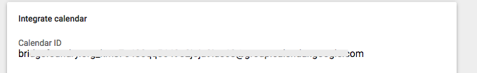

# Google Calendar Time Tracker

Simple App Script utility that tracks duration of meetings in a Google calendar.

In the sharing settings for the specific calendar, find the ID:

Make a copy of [this sheet](https://docs.google.com/spreadsheets/d/1txbuSoGCjrlRao2A-kF8jjFWRi2qiWq4pG2TixL_xh4/edit#gid=0) and put your calendar ID there.

Then add the script (Tools > Script Editor...)

An "Hours" menu should appear, choosing "Calculate Hours" will fill out the sheet.